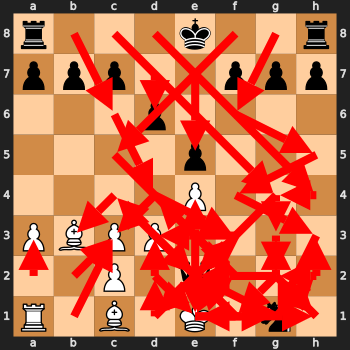

# Chessboard History

This program generates a chessboard SVG with a move history for a given [PGN](https://de.wikipedia.org/wiki/Portable_Game_Notation).

## Usage

Using _evenly_:
```python
pgn = "1. e4 e5 2. Qf3 Nc6 3. Bc4 Nf6 4. Ne2 Bc5 5. a3 d6 6. O-O Bg4 7. Qd3 Nh5 8. h3 Bxe2 9. Qxe2 Nf4 10. Qe1 Nd4 11. Bb3 Nxh3+ 12. Kh2 Qh4 13. g3 Nf3+ 14. Kg2 Nxe1+ 15. Rxe1 Qg4 16. d3 Bxf2 17. Rh1 Qxg3+ 18. Kf1 Bd4 19. Ke2 Qg2+ 20. Kd1 Qxh1+ 21. Kd2 Qg2+ 22. Ke1 Ng1 23. Nc3 Bxc3+ 24. bxc3 Qe2#"
ch = ChessboardHistory()
ch.print_history(pgn,"#ff0000",fade_function="evenly")
```


____

Using _last2_:

```python
pgn = "1. e4 e5 2. Qf3 Nc6 3. Bc4 Nf6 4. Ne2 Bc5 5. a3 d6 6. O-O Bg4 7. Qd3 Nh5 8. h3 Bxe2 9. Qxe2 Nf4 10. Qe1 Nd4 11. Bb3 Nxh3+ 12. Kh2 Qh4 13. g3 Nf3+ 14. Kg2 Nxe1+ 15. Rxe1 Qg4 16. d3 Bxf2 17. Rh1 Qxg3+ 18. Kf1 Bd4 19. Ke2 Qg2+ 20. Kd1 Qxh1+ 21. Kd2 Qg2+ 22. Ke1 Ng1 23. Nc3 Bxc3+ 24. bxc3 Qe2#"
ch = ChessboardHistory()
ch.print_history(pgn,"#ff0000",fade_function="last2")
```
